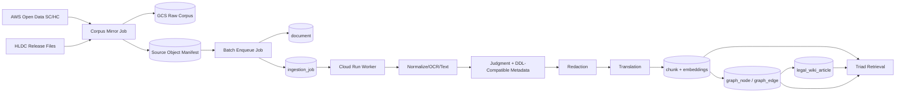

# Infrastructure Review: Large Legal Corpus Ingestion

Date: 2026-05-23  
Scope: HLDC district-court text, AWS Supreme Court judgments, AWS High Court judgments, criminal-case-only ingestion, metadata extraction, judgment text extraction, vectors, KG, and legal wiki.

## Update: Cloud SQL Baseline Upgrade

After this review, `policing-db-v2` was upgraded in place as the first large-corpus baseline:

- Tier: `db-custom-4-16384`
- CPU/RAM: 4 vCPU / 16 GiB
- Storage: 250 GB PD SSD
- Storage auto-increase: enabled
- Query Insights: enabled, 5 plans/minute, 4,500 byte query string capture
- Availability: still zonal
- Automated backups: still disabled by request

The Cloud SQL update operation completed successfully and the instance returned to `RUNNABLE`. DB connectivity and API health checks passed after the resize.

## Readiness Verdict

**CONDITIONAL / NOT READY FOR FULL-SCALE CORPUS YET**

The product architecture is directionally right: raw source documents become `document` rows, the worker pipeline handles extraction/redaction/translation/chunking/embedding/KG, and judgment metadata already includes court fields. However, the live infrastructure and queue model are pilot-scale. Before ingesting hundreds of thousands or millions of judgments, we need a manifest-first staging layer, stronger queue semantics, a larger/safer Cloud SQL configuration, source partitioning controls, and operational dashboards.

## Preflight

- Active GCP account verified during review: `vk@adssoftek.com`.
- Active GCP project verified during review: `policing-apps`.
- Live Cloud Run access verified for `policing-apps`.
- Live Cloud SQL instance inspected: `policing-db-v2`, PostgreSQL 15, `db-f1-micro`, 10 GB PD SSD, zonal, backups disabled.
- Live worker inspected: `police-cases-kb-worker`, min/max scale 1, 1 CPU, 1 GiB memory, concurrency 1.
- Live corpus size inspected:
  - `document`: 286
  - `chunk`: 3,215
  - chunks with embeddings: 3,215
  - `district_case`: 508,950
  - `district_text_artifact`: 0
  - DB size: 1.7 GB
  - `ingestion_job`: 368 failed, 12 processing, 1,773 completed

## System Map

## Confirmed Strengths

- The ingestion pipeline already has separate stages for judgment text processing: `VALIDATE -> SPLIT -> NORMALIZE -> CONVERT -> METADATA_EXTRACT -> REDACT -> TRANSLATE -> CHUNK -> EMBED`, with optional `KG_EXTRACT` in [job_poller.py](/Users/n15318/RAG-app/apps/worker/src/job_poller.py:22).
- Judgment metadata already models court identity: `court_code`, `court_name`, `court_level`, bench strength, decision date, statutes, sections, source license, and sensitive flags in [metadata_extractor.py](/Users/n15318/RAG-app/apps/worker/src/pipeline/metadata_extractor.py:28).
- DDL-compatible district metadata already has the right target shape: state/district/court/case type/dates/disposition/acts/sections/offence flags in [ddl_metadata.py](/Users/n15318/RAG-app/apps/worker/src/sources/ddl_metadata.py:27).
- AWS SC/HC buckets are already known to the API in [document-routes.ts](/Users/n15318/RAG-app/apps/api/src/routes/document-routes.ts:15).
- HLDC is already marked non-commercial by the loader in [hldc.py](/Users/n15318/RAG-app/apps/worker/src/sources/hldc.py:30).
- Vector, FTS, metadata, KG, and wiki indexes already exist on the key tables in the live DB.

## Findings

### P0: Live Cloud SQL Was Far Below Required Scale

- **Status:** Confirmed
- **Confidence:** High
- **Risk score:** 25
- **Evidence:** At review time, live `policing-db-v2` was `db-f1-micro`, 10 GB disk, zonal, backups disabled. `district_case` alone was already 1.2 GB, with only metadata and no judgment text artifacts. This has now been partially remediated by upgrading to `db-custom-4-16384` and 250 GB SSD storage.
- **What:** Keep the upgraded baseline, then size further from pilot ingestion metrics before full corpus scale.
- **Where:** `policing-db-v2` and deployment runbooks.
- **How:** Move to at least a production tier with high availability, automated backups, larger storage, query insights, and a storage growth target sized from expected chunks/vectors/KG.
- **Verify:** Confirm DB tier, backup status, HA status, disk size, query latency, storage growth, and successful restore drill before full bulk ingest.

### P0: Ingestion Queue Has Stale Processing Jobs and No Dead-Letter Discipline

- **Status:** Confirmed
- **Confidence:** High
- **Risk score:** 20
- **Evidence:** 12 `PROCESSING` jobs have March 2026 `locked_until` timestamps. The worker polls only `PENDING` and `RETRYING` rows in [job_poller.py](/Users/n15318/RAG-app/apps/worker/src/job_poller.py:60), so stale `PROCESSING` rows are not automatically reclaimed.
- **What:** Add stale-lock recovery and dead-letter states before scaling.
- **Where:** `ingestion_job`, [job_poller.py](/Users/n15318/RAG-app/apps/worker/src/job_poller.py:56), migration for queue status.
- **How:** Add a periodic reaper that marks expired `PROCESSING` jobs as `RETRYING` or `FAILED`, add `DEAD_LETTER`, and add failure reason categories.
- **Verify:** Kill a worker mid-job and confirm the job is retried or dead-lettered without manual SQL.

### P0: Current API Import Path Is Not Suitable for Full Corpus Mirroring

- **Status:** Confirmed
- **Confidence:** High
- **Risk score:** 20
- **Evidence:** The API imports a single AWS object by downloading it through the API request, buffering it into memory, creating a `document`, and immediately enqueuing ingestion in [document-routes.ts](/Users/n15318/RAG-app/apps/api/src/routes/document-routes.ts:548).
- **What:** Use GCS mirror + manifest + batch enqueue instead of browser/API import for full corpus ingestion.
- **Where:** New source manifest and worker/Cloud Run Job scripts.
- **How:** Copy external source files to GCS first, store manifest rows, then create `document` rows only in bounded batches.
- **Verify:** 10,000 object copy dry run writes manifest rows without creating application documents or exhausting API memory.

### P1: Worker Scaling Is Single-Instance Pilot Scale

- **Status:** Confirmed
- **Confidence:** High
- **Risk score:** 16
- **Evidence:** Deploy script fixes worker at 1 CPU, 1 GiB, min/max instances 1, concurrency 1 in [deploy-police-cases-kb-cloudrun.sh](/Users/n15318/RAG-app/scripts/deploy-police-cases-kb-cloudrun.sh:267). Live Cloud Run service matches this shape.
- **What:** Split workers by workload class.
- **Where:** Cloud Run services/jobs and worker config.
- **How:** Create separate worker services or jobs for mirroring, OCR, translation, embeddings, KG extraction, and wiki generation. Give each its own concurrency, CPU/memory, quota, and retry policy.
- **Verify:** Run independent scale tests for OCR, embedding, and KG queues without starving simple metadata jobs.

### P1: Criminal-Only Filtering Must Move Earlier in the Pipeline

- **Status:** Partially Confirmed
- **Confidence:** High
- **Risk score:** 16
- **Evidence:** DDL normalizer can classify criminal targets in [ddl_metadata.py](/Users/n15318/RAG-app/apps/worker/src/sources/ddl_metadata.py:76). AWS import currently creates documents without a pre-ingest criminal filter in [document-routes.ts](/Users/n15318/RAG-app/apps/api/src/routes/document-routes.ts:609).
- **What:** Add source-specific criminal prefilters before document creation.
- **Where:** Manifest stage and enqueue stage.
- **How:** For DDL/HLDC, use metadata/text headers. For SC/HC, first catalog court/year/file metadata, then run lightweight metadata extraction/classification before full OCR/KG.
- **Verify:** Non-criminal manifest rows are not enqueued unless explicitly allowed.

### P1: HLDC Metadata Is Not Yet DDL-Compatible

- **Status:** Confirmed
- **Confidence:** High
- **Risk score:** 12
- **Evidence:** Current HLDC loader only returns id, text, language, license, and raw metadata in [hldc.py](/Users/n15318/RAG-app/apps/worker/src/sources/hldc.py:9). DDL-compatible target fields are available in [ddl_metadata.py](/Users/n15318/RAG-app/apps/worker/src/sources/ddl_metadata.py:27).
- **What:** Build HLDC metadata extraction as a first pipeline branch.
- **Where:** `apps/worker/src/sources/hldc.py` and a new `ingest_hldc_corpus.py`.
- **How:** Extract CNR, court, district, date, acts, sections, bail/disposition labels, offence categories, and source confidence into `DistrictCaseRecord`-compatible rows; keep missing fields null.
- **Verify:** Pilot report shows per-field coverage and exact/fuzzy/HLDC-only mapping rates.

### P1: Court Identification Exists but Needs Source-Specific Hardening

- **Status:** Partially Confirmed
- **Confidence:** High
- **Risk score:** 12
- **Evidence:** Judgment metadata prompt and payload support `court_code`, `court_name`, and `court_level` in [metadata_extractor.py](/Users/n15318/RAG-app/apps/worker/src/pipeline/metadata_extractor.py:31). AWS key parser currently extracts only year and court code from path in [document-routes.ts](/Users/n15318/RAG-app/apps/api/src/routes/document-routes.ts:105).
- **What:** Create canonical court registry and source-specific court mapping.
- **Where:** New `court_registry` table/config and metadata extractor.
- **How:** Map AWS court codes, DDL state/district/court numbers, HLDC court headers, and extracted text court names into canonical court identities.
- **Verify:** Every ingested judgment has `court_level` and either `court_code` or `court_name`; unknowns are reported.

### P1: KG Extraction Is Globally Enabled After Every Embed

- **Status:** Confirmed
- **Confidence:** High
- **Risk score:** 12
- **Evidence:** `kg_extraction` feature flag defaults true in migration, and `EMBED` completion enqueues `KG_EXTRACT` when the flag is enabled in [job_poller.py](/Users/n15318/RAG-app/apps/worker/src/job_poller.py:148).
- **What:** Gate KG by corpus, source, offence family, confidence, and batch size.
- **Where:** `feature_flag`, job enqueue logic, corpus manifest.
- **How:** Replace global `kg_extraction` with scoped policies: source, court level, year, offence category, max docs/day, and review thresholds.
- **Verify:** A broad document ingest does not automatically start unbounded KG extraction.

### P1: Production Worker Translation Still Points to Google

- **Status:** Confirmed
- **Confidence:** High
- **Risk score:** 9
- **Evidence:** Live worker env has `TRANSLATION_PROVIDER=google`. Local code now supports OpenAI, but live Cloud Run has not been redeployed.
- **What:** Redeploy worker with `TRANSLATION_PROVIDER=openai` and `TRANSLATION_OPENAI_MODEL`.
- **Where:** Cloud Run worker env and [deploy-police-cases-kb-cloudrun.sh](/Users/n15318/RAG-app/scripts/deploy-police-cases-kb-cloudrun.sh:242).
- **How:** Deploy after queue and DB safeguards are in place.
- **Verify:** Worker env shows OpenAI provider and a Hindi translation pilot creates `TRANSLATED_TEXT`.

### P2: No Corpus Manifest or Copy Status Model Yet

- **Status:** Confirmed
- **Confidence:** High
- **Risk score:** 12
- **Evidence:** Current plan file defines manifest-first ingestion, but no manifest table exists yet.
- **What:** Add `legal_corpus_object` manifest.
- **Where:** New migration and worker scripts.
- **How:** Fields: source, source URI, GCS URI, size, checksum, court/year, license, copied status, document status, processing status, error category.
- **Verify:** Re-running a mirror job is idempotent and resumes from manifest status.

### P2: Observability Is Too Thin for Million-Document Runs

- **Status:** Partially Confirmed
- **Confidence:** Medium
- **Risk score:** 12
- **Evidence:** Worker uses logging and DB status rows, but no confirmed queue-depth metrics, per-stage throughput, provider cost, OCR failure, or source quality dashboards at full-corpus level.
- **What:** Add ingestion observability tables/views and dashboards.
- **Where:** API admin/source dashboard and DB rollup views.
- **How:** Track copied bytes, queued docs, per-step throughput, step duration p50/p95, failure reason, provider cost, token usage, OCR confidence, translation status, KG quality.
- **Verify:** Operators can answer "what is stuck, where, and why" without SQL.

## Architecture Recommendation

Use a two-branch pipeline:

1. **Metadata branch**
   - DDL/HLDC/AWS source manifest -> normalized metadata -> criminal filter -> court registry -> `district_case` or `judgment_metadata`.
   - This branch should be cheap and broad.

2. **Judgment text branch**
   - Only criminal or selected corpus rows -> source document/text -> redaction -> translation -> chunking -> embeddings -> KG -> wiki.
   - This branch should be expensive, throttled, and batch-gated.

The criminal filter should happen before OCR, translation, embeddings, KG, and wiki whenever possible.

## QA Gate Scorecard

| Gate | Status | Notes |
|---|---|---|
| Correct GCP identity | PASS | `vk@adssoftek.com` active and Cloud Run access verified. |
| DB scale readiness | FAIL | `db-f1-micro`, 10 GB, zonal, backups disabled. |
| Queue reliability | FAIL | Stale `PROCESSING` jobs and no dead-letter discipline. |
| Corpus staging | PARTIAL | GCS exists; manifest-first corpus model not implemented. |
| Criminal-only filtering | PARTIAL | DDL filter exists; AWS/HLDC full prefilter not implemented. |
| Court identification | PARTIAL | Schema supports it; canonical registry/mapping needed. |
| Translation | PARTIAL | Code supports OpenAI; live worker still configured as Google. |
| KG/wiki scale control | PARTIAL | KG exists but global enablement is too broad. |
| Observability | PARTIAL | Some status tables exist; no large-run operator dashboard. |

## Prioritized Backlog

1. Upgrade Cloud SQL: HA, backups, larger storage, query insights, appropriate tier.
2. Add stale-job recovery and dead-letter queue.
3. Add corpus manifest table and GCS mirror jobs.
4. Split worker services/jobs by stage and workload.
5. Build HLDC DDL-compatible metadata extraction and mapping report.
6. Add criminal-only manifest filtering for HLDC and AWS SC/HC.
7. Add canonical court registry and source-specific court mappers.
8. Gate KG/wiki generation by source/court/year/offence and quality thresholds.
9. Add large-run observability dashboard.
10. Redeploy worker with OpenAI translation provider after queue/DB safeguards.

## Quick Wins

- Reset or requeue stale March `PROCESSING` jobs after reviewing affected documents.
- Disable broad KG extraction during corpus copy/import pilots.
- Add a small `legal_corpus_object` manifest before any new bulk copy.
- Run a 100-document pilot per source before scaling.
- Keep HLDC in a non-commercial partition from day one.
